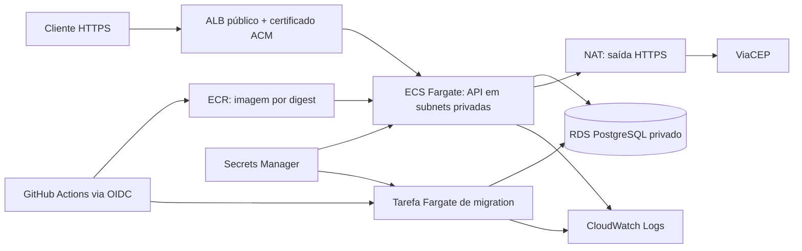

# Arquitetura AWS e roteiro de implantação

## Estado da entrega

Este documento descreve uma proposta, não uma infraestrutura provisionada.
A conta AWS não pôde ser ativada; staging e production não foram publicados.
Não foram executados OIDC, migrations no ECS, rollout, rollback nem restauração RDS.
Não há templates Terraform/CloudFormation nesta entrega.

Docker, API e testes foram validados localmente. Os workflows GitHub Actions
estão implementados e tiveram validação local; sua execução hospedada continua
pendente. Para avaliar a aplicação sem AWS, seguir o início rápido do
[README](../README.md). Manter `AWS_DEPLOY_ENABLED` ausente ou `false`.

## Escolha de arquitetura

| Opção considerada | Avaliação para este projeto |
|---|---|
| ECS/Fargate | Escolhido: execução da imagem Docker, tarefa separada para migrations e controle explícito da rede e promoção por digest. Exige provisionar mais componentes. |
| App Runner | Alternativa de hospedagem gerenciada; não adotada. O desenho existente precisa de controle explícito da tarefa de migration e do serviço ECS. |
| Elastic Beanstalk | Alternativa com gerenciamento da plataforma; exigiria adaptar o fluxo de implantação já preparado para ECS. |
| EC2 | Daria controle do servidor, mas acrescentaria manutenção do sistema operacional sem necessidade para este desafio. |

A escolha prioriza demonstrar o ciclo de implantação de containers, não o menor
custo possível. Região, orçamento, domínio e tamanho final dependem de uma conta
ativa e de estimativa antes do provisionamento. Não há promessa de custo zero.

## Topologia proposta por ambiente



O diagrama representa dependências; o download da imagem e a injeção de secrets
são feitos pela infraestrutura ECS com a execution role.

Staging e produção terão serviços, bancos, credenciais, security groups e logs
separados. Para a demonstração, podem estar na mesma conta, com VPC por ambiente.
O ECR pode ser compartilhado para promover exatamente o mesmo digest.
Separação em contas é uma evolução possível, exigindo políticas de acesso entre contas.

Proposta inicial para validar, sujeita a medição: uma tarefa de 0,5 vCPU/1 GiB por
ambiente e RDS Single-AZ. Isso não oferece alta disponibilidade. Uma operação real
exigiria avaliar duas ou mais tarefas distribuídas por AZ e RDS Multi-AZ.

## Rede e segurança

- ALB em duas subnets públicas de AZs distintas, listener HTTPS 443 com ACM;
  HTTP 80 apenas redireciona para HTTPS. DNS do domínio aponta para o ALB.
- Tarefas Fargate em subnets privadas, `awsvpc`, sem IP público. Target group
  do tipo `ip`, HTTP 8000, readiness em `/health/ready/`, sucesso apenas em 200.
- Security group da API aceita 8000 somente do security group do ALB.
  RDS aceita 5432 somente das tarefas API/migration; não tem acesso público.
- Saída das tarefas via NAT para serviços AWS e ViaCEP. Endpoints privados AWS
  podem reduzir dependência do NAT para esses serviços, mas não fornecem acesso
  ao ViaCEP. Planejar custo e disponibilidade da saída por AZ.
- Secrets Manager guarda chaves Django/JWT distintas e credenciais PostgreSQL
  por ambiente. Task definition contém referências a secrets, não seus valores.
- Execution role permite baixar a imagem, obter secrets e publicar logs. Task
  role da aplicação não precisa de permissões AWS adicionais no escopo atual.
- Role de deploy via OIDC limitada ao repositório/Environment, com audiência
  `sts.amazonaws.com`. Limitar PassRole às roles ECS esperadas e permissões de
  ECR/ECS aos recursos do projeto, conforme os recursos finalmente criados.

Referência de rede: [Fargate task networking](https://docs.aws.amazon.com/AmazonECS/latest/developerguide/fargate-task-networking.html).

## Contrato com a aplicação e os workflows

A task definition base de cada ambiente precisa de container essencial `api`,
imagem Linux/x86_64, porta 8000 e comando padrão Gunicorn do Dockerfile.
Usar controller ECS e circuit breaker com rollback no serviço.

Definir `DJANGO_SETTINGS_MODULE=config.settings.staging` ou
`config.settings.production`, `DJANGO_DEBUG=false`, hosts explícitos, origens CORS
necessárias, chaves fortes e conexão RDS com TLS. Preferir `verify-full` com o
certificado CA RDS disponibilizado à imagem e `POSTGRES_SSLROOTCERT` configurado;
essa distribuição do certificado ainda precisa ser implementada e validada.

Ativar `DJANGO_TRUST_PROXY_SSL_HEADER=true` somente depois de confirmar que o ALB
fornece o protocolo correto e que não há caminho público para contorná-lo.
Os avisos HSTS documentados no README continuam sujeitos à validação do domínio.

**Ponto de integração pendente:** o ALB envia o IP privado do target no Host do
healthcheck, enquanto a aplicação exige hosts explícitos. Antes do primeiro
rollout, validar esse cenário com as configurações reais e implementar, se
necessário, tratamento restrito à rota de healthcheck. Não usar `ALLOWED_HOSTS=*`
nem desabilitar a validação de hosts da API para contornar o problema.
Referência: [Host dos healthchecks ALB](https://docs.aws.amazon.com/elasticloadbalancing/latest/application/load-balancer-troubleshooting.html).

Cache e throttling atuais são locais ao processo: não representam limite global
entre workers ou tarefas. Um cache compartilhado e a política de limites precisam
ser definidos antes de operar em escala. Logs têm retenção proposta de sete dias
na demonstração; alertas para falhas de tarefa, targets sem saúde, erros 5xx e banco
precisam ser configurados. Backup só deve ser considerado validado após restauração.

## Ordem de implantação quando houver conta

1. Estimar custo, definir região/domínio e configurar alertas de orçamento.
2. Criar rede, security groups, ECR, logs, secrets e RDS PostgreSQL por ambiente.
3. Criar roles ECS e OIDC. Configurar os Environments GitHub com restrição a main
   e aprovação obrigatória em production, sem autoaprovação.
4. Registrar as task definitions base e criar ALB, certificado e serviços ECS.
   Resolver o bootstrap: publicar uma imagem inicial validada antes de exigir
   tarefas saudáveis; não tentar iniciar serviço com uma referência inexistente.
5. Preencher as Variables listadas no [README](../README.md), incluindo o ARN
   com revisão da task definition base. Validar rede, TLS, healthcheck e secrets.
6. Habilitar `AWS_DEPLOY_ENABLED=true`. Executar pipeline em main para staging:
   lint → testes PostgreSQL → build → ECR → migration → atualização do serviço.
7. Conferir logs sem secrets, revisão ativa, readiness, Swagger, JWT e CRUD por
   HTTPS. Usar dados fictícios e remover os registros de validação depois.
8. Executar Pipeline manualmente em main com production marcado. O fluxo repete
   staging e promove o mesmo digest após aprovação. Validar produção e rollback.

O workflow não cria infraestrutura nem aplica configurações de aprovação do GitHub.
As migrations rodam com as credenciais da tarefa e precisam das permissões DDL
adequadas. Se uma migration falhar, o serviço não é atualizado; o banco pode ter
mudanças parciais de migrations anteriores. Investigar antes de repetir.

## Rollback operacional proposto

Antes do deploy, registrar o ARN da task definition ativa e seu digest. Preservar
essa revisão e imagem no ECR durante a janela de rollback.

Se a migration terminou, mas o novo serviço falhou, o circuit breaker pode
restaurar a revisão anterior. Confirmar a revisão ativa e consultar os logs;
o pipeline confere a revisão esperada para não anunciar rollback como sucesso.

Para rollback manual, após verificar a compatibilidade do banco, selecionar a
revisão anterior validada. Exemplo a executar apenas numa conta configurada:

```bash
aws ecs update-service --cluster "$ECS_CLUSTER" --service "$ECS_SERVICE" \
  --task-definition "$PREVIOUS_TASK_DEFINITION"
aws ecs wait services-stable --cluster "$ECS_CLUSTER" --services "$ECS_SERVICE"
aws ecs describe-services --cluster "$ECS_CLUSTER" --services "$ECS_SERVICE" \
  --query 'services[0].{task:taskDefinition,running:runningCount,desired:desiredCount}'
```

Conferir a revisão retornada e repetir os testes HTTPS. Voltar a imagem não desfaz
migrations: preferir mudanças de banco compatíveis com ambas as versões. Para
perda/corrupção de dados, restauração RDS para outra instância e reconciliação
exigem procedimento próprio e estimativa da perda de dados; não executar reversão
automática de migrations destrutivas.

Em timeout ou cancelamento do job, verificar se a tarefa de migration ainda está
rodando antes de iniciar outra. Para encerrar a demonstração, remover recursos
somente após preservar o que for necessário: parar tarefas não elimina custos
de banco, ALB, NAT, armazenamento, logs e outros recursos mantidos.
