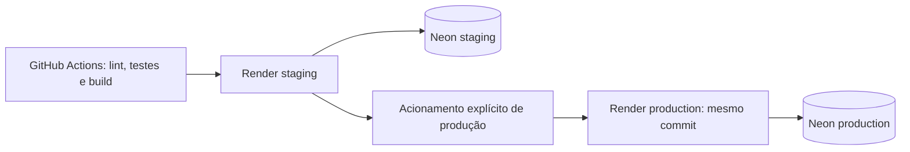

# Implantação no Render e Neon

## Ambientes e estado de validação

| Ambiente | API | Banco |
|---|---|---|
| Staging | https://elo-saude-staging.onrender.com | Projeto Neon próprio; PostgreSQL 18 |
| Production | https://elo-saude-production.onrender.com | Outro projeto Neon; PostgreSQL 18 |

Os ambientes usam chaves Django/JWT, credenciais e bancos separados. Não compartilham
dados. Staging passou por 21 verificações HTTPS autenticadas em 15/09/2026, com
remoção dos dados temporários. Produção passou por 23 verificações HTTPS em
16/09/2026, também com remoção dos dados e usuário temporários. O pipeline Render foi validado no GitHub na [execução 35052382786](https://github.com/Renatoxdev/elo-saude/actions/runs/35052382786):
lint, testes, build, staging e produção passaram, publicando o mesmo commit
`bd5f91e` e confirmando readiness em ambos os ambientes. Não há credenciais de avaliação públicas.

## Reproduzir o ambiente

1. Criar dois projetos PostgreSQL no Neon, com roles e senhas diferentes.
2. Criar dois Web Services Docker no Render, ligados a este repositório, branch
   `main`, Dockerfile `./Dockerfile` e contexto `.`. Escolher explicitamente o
   plano Free se a intenção for reproduzir a demonstração gratuita.
3. Definir Docker Command `/bin/sh /app/scripts/start_render.sh` e Health Check
   Path `/health/ready/`. O script faz migrations antes de executar Gunicorn;
   qualquer falha nas migrations impede a inicialização daquela versão.
4. Configurar as variáveis abaixo em cada serviço. Não enviar `.env` ao GitHub.
5. Desativar **Auto-Deploy** nos dois serviços. O GitHub controla as publicações.
6. Configurar os Environments e secrets do GitHub conforme a próxima seção.

| Variável do Render | Valor |
|---|---|
| `DJANGO_SETTINGS_MODULE` | `config.settings.staging` ou `config.settings.production` |
| `DJANGO_DEBUG` | `false` |
| `DJANGO_ALLOWED_HOSTS` | Host exato atribuído pelo Render, sem protocolo |
| `DJANGO_CSRF_TRUSTED_ORIGINS` | `https://` seguido do host, se usando admin |
| `DJANGO_TRUST_PROXY_SSL_HEADER` | `true`, para HTTPS terminado pelo proxy Render |
| `DJANGO_SECRET_KEY` / `DJANGO_JWT_SIGNING_KEY` | Chaves aleatórias distintas de pelo menos 50 caracteres |
| `POSTGRES_HOST` / `POSTGRES_DB` / `POSTGRES_USER` / `POSTGRES_PASSWORD` | Conexão direta do projeto Neon correspondente |
| `POSTGRES_PORT` / `POSTGRES_SSLMODE` | `5432` / `require` |
| `POSTGRES_CONNECT_TIMEOUT` | `15` |
| `WEB_CONCURRENCY` / `PORT` | `1` / `8000` |

O projeto lê campos `POSTGRES_*`, não `DATABASE_URL`. O CORS permanece fechado
por padrão; definir `DJANGO_CORS_ALLOWED_ORIGINS` apenas se houver um frontend
separado. O proxy é confiável nesta topologia; não reutilizar essa configuração
em servidor com acesso direto desprotegido.

## CI/CD

O [Pipeline](../.github/workflows/pipeline.yml) executa lint → testes PostgreSQL →
build Docker → Render staging. Em execução manual em `main`, com `production=true`,
publica também produção somente após staging passar. Os dois recebem explicitamente
o mesmo SHA do GitHub. PRs não executam deploy nem recebem credenciais Render.

O Render reconstrói o Dockerfile para cada serviço a partir desse SHA: a promoção
é do mesmo código, não do mesmo digest da imagem construída pelo CI. Dependências
Python estão travadas no lockfile, mas a imagem base pode mudar entre builds.
A [avaliação de promoção por digest](OPERATIONS.md#imagem-única-decisão-e-migração-proposta)
detalha a alternativa image-backed/GHCR e os motivos para preservar os serviços atuais.
Essa migração não foi implantada; nenhum digest é alegado para os deploys atuais.

Configuração no GitHub:

- Repository secret `RENDER_API_KEY`, obtido na conta Render.
- Repository variable `RENDER_DEPLOY_ENABLED=true` e `AWS_DEPLOY_ENABLED=false`.
- Environments `staging` e `production`, restritos à branch `main`.
- Em cada Environment, variable `RENDER_SERVICE_ID` com o ID do respectivo serviço.

A proteção de produção nesta demonstração é o acionamento manual do Pipeline.
Para equipe com revisores, acrescentar aprovação obrigatória no GitHub Environment.

O [workflow Render](../.github/workflows/deploy-render.yml) usa um script Python
sem dependências adicionais. Confere repositório, branch e Auto-Deploy desativado;
solicita o SHA exato, aguarda o deploy identificado ficar `live`, confere o SHA
retornado e exige readiness JSON `status=ok` por HTTPS. Erro, cancelamento, commit
incorreto ou timeout falham o job e bloqueiam a próxima etapa. A chave não é enviada
ao healthcheck, e respostas de erro da API Render não são impressas.

Cancelamento ou timeout do GitHub não garante cancelamento no Render. Antes de
repetir, verificar o deploy e a execução de migrations no painel. Não iniciar
migrations concorrentes manualmente.

## Validação e acesso

Após deploy, verificar `/health/ready/`, `/api/docs/` e resposta 401 de
`/api/v1/professionals/` sem token. Um usuário ativo provisionado pelo Django permite
login em `/api/v1/auth/token/` e testes do CRUD. Usuários temporários de validação
são removidos ao final; não há cadastro público ou senha padrão. Se a avaliação
exigir credenciais remotas, provisionar um usuário específico e transmitir sua
senha por canal privado, nunca no README público.

O Free não oferece shell remoto. Para provisionar usuários, um operador autorizado
pode usar `manage.py createsuperuser` localmente com as variáveis de conexão do
ambiente remoto e TLS. Não rodar `manage.py test` contra esse banco: os testes de
CI usam seu PostgreSQL separado. Não substituir o `.env` local sem guardar sua
configuração; preferir variáveis injetadas apenas no processo administrativo.

## Rollback

O [ensaio executado em staging](ROLLBACK_STAGING.md) contém as evidências reais.
O [runbook operacional](OPERATIONS.md) detalha verificações, retorno seguro,
monitoramento, backup/restauração e escalabilidade.

1. Desativar `RENDER_DEPLOY_ENABLED` no GitHub e verificar execuções em andamento,
   para não disputar com uma publicação automática. Auto-Deploy deve continuar Off.
2. No serviço Render, abrir **Events/Deploys**, selecionar uma versão anterior
   bem-sucedida cujo build ainda esteja disponível e escolher **Rollback**.
3. Conferir commit, variáveis e comando daquela versão. Rollback pode recuperar
   configurações antigas, incluindo credenciais que já foram rotacionadas.
4. Aguardar estado Live e verificar readiness, Swagger e fluxo autenticado.
5. Corrigir ou reverter o código em `main`, passar o CI e reabilitar a automação
   conscientemente. Produção continua dependendo de acionamento explícito.

Rollback não desfaz o banco. O script de início executa `migrate` novamente;
a versão anterior precisa ser compatível com as migrations já aplicadas. Preferir
mudanças aditivas e nunca reverter migrations destrutivas automaticamente. Restauração
ou recuperação de dados no Neon é um procedimento separado, sujeito ao plano e à
janela de retenção. Não foi validada restauração nesta entrega.

Referência: [Rollback no Render](https://render.com/docs/rollbacks).

## Limites da demonstração

O serviço gratuito dorme por inatividade, tem filesystem efêmero e não oferece
alta disponibilidade. Horas e outros limites são compartilhados com os demais
serviços do workspace. O banco externo também tem limites próprios. Estes são
ambientes funcionais de avaliação, não uma promessa de disponibilidade comercial.
As migrations no início são uma concessão ao plano gratuito, que não oferece
pre-deploy separado; manter uma instância por serviço e deploys serializados.
Cache/throttling em memória continuam locais ao processo.

Referências: [Free](https://render.com/docs/free),
[Deploy por commit](https://api-docs.render.com/reference/create-deploy),
[Neon](https://neon.com/pricing).
